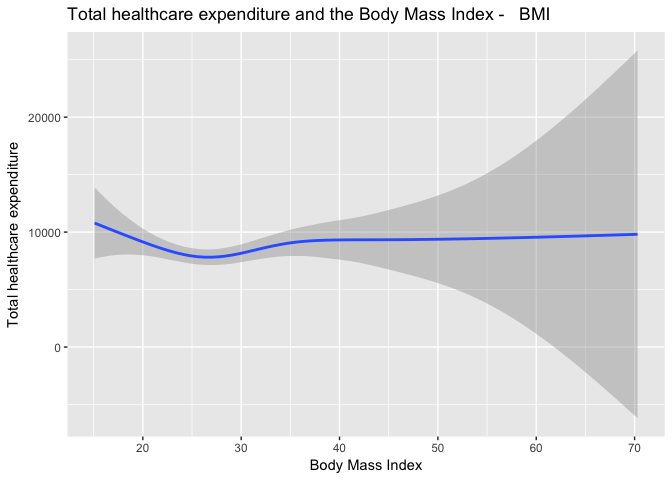
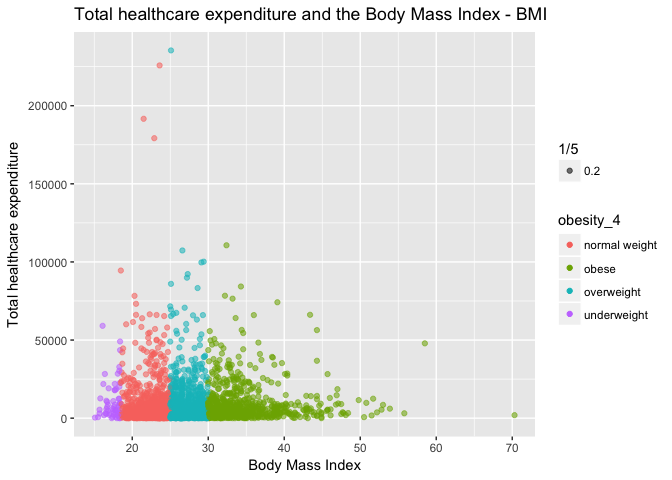

Final Project Proposal
================
Julie Nguyen

Plot in R
---------

We use STATA to run our analysis especially when Lillian showed the a very smart way to run our regression: Ex: reg totalexp **i.obesity\_4** smoker income msa educ male race

As for scatter plot or regression vizualization, we want to try the **new package in R (ggplot 2 from tidyverse)** as this is a powerful tool to do with colors and other stuff. As we are all beginners, it took us so much time to do so but we are happy to get what we want.

Download R package tidyverse and ggplot
---------------------------------------

``` r
# You should install the package "tidyverse" before running the code
#install.packages("tidyverse")
library(tidyverse)
```

    ## -- Attaching packages -------------------------------------------------------------- tidyverse 1.2.1 --

    ## <U+221A> ggplot2 2.2.1.9000     <U+221A> purrr   0.2.4     
    ## <U+221A> tibble  1.4.2          <U+221A> dplyr   0.7.4     
    ## <U+221A> tidyr   0.8.0          <U+221A> stringr 1.3.0     
    ## <U+221A> readr   1.1.1          <U+221A> forcats 0.3.0

    ## -- Conflicts ----------------------------------------------------------------- tidyverse_conflicts() --
    ## x dplyr::filter() masks stats::filter()
    ## x dplyr::lag()    masks stats::lag()
    ## x dplyr::vars()   masks ggplot2::vars()

``` r
library(ggplot2)
```

Import and read STATA data: meps\_senior.dta
--------------------------------------------

``` r
#install.packages("haven")
library(haven)
meps_senior <- read_dta("meps_senior.dta")
```

Create the 4 packages according the BMI: underweight, normal weight, overweight and obese (equivalent of creation dummy variable in STATA)
------------------------------------------------------------------------------------------------------------------------------------------

``` r
new_meps_senior <-   
  mutate(meps_senior, obesity_4 = ifelse(bmi> 15.1 & bmi <18.5,"underweight",
  ifelse(bmi >= 18.5 & bmi < 25, "normal weight",
  ifelse(bmi >= 25 & bmi <30,"overweight","obese"))))
```

Creation of scatter plot and quasi-regression line
--------------------------------------------------

``` r
# 1st graph

new_meps_senior %>%
  ggplot(mapping = aes(x = bmi, y = totalexp)) +
  geom_smooth(se = T)+
  labs(title = "Total healthcare expenditure and the Body Mass Index -   BMI") +
  ylab("Total healthcare expenditure")+
  xlab("Body Mass Index")
```

    ## `geom_smooth()` using method = 'gam' and formula 'y ~ s(x, bs = "cs")'



``` r
# 2nd graph with color 

new_meps_senior %>%
  ggplot()+
  geom_point(aes(x=bmi, y=totalexp, color = obesity_4, alpha = 1/5)) +
  labs(title = "Total healthcare expenditure and the Body Mass Index - BMI") +
  ylab("Total healthcare expenditure")+
  xlab("Body Mass Index")
```


